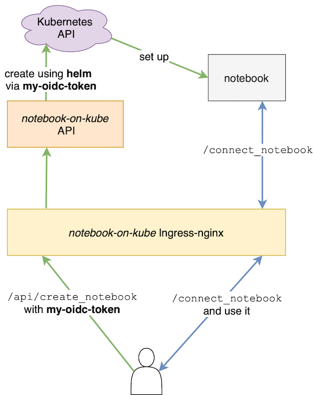
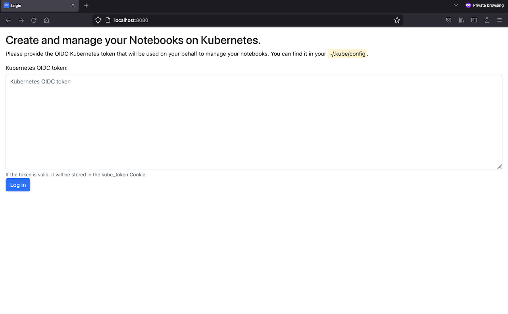
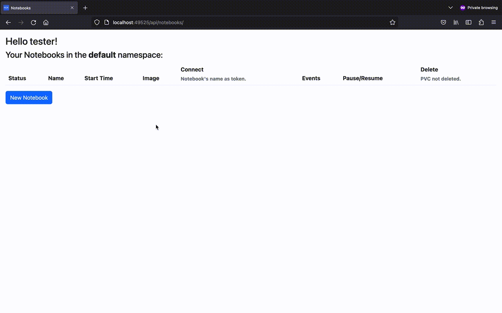

# notebook-on-kube


Create and manage your `Jupyter` notebooks on `Kubernetes` **without** `JupyterHub` :)

### How and why?

Currently, if you want to deploy `Jupyter` notebooks on `Kubernetes` using available open-source tools, you need to choose between two major approaches:

- One that re-implements the notebooks management logic the `Kubernetes` way, it:
  - integrates well with `Kubernetes` ecosystem: using [Operators](https://kubernetes.io/docs/concepts/extend-kubernetes/operator/) and [CRD](https://kubernetes.io/docs/concepts/extend-kubernetes/api-extension/custom-resources/).
  - is usually part of a bigger toolkit ([Kubeflow](https://www.kubeflow.org) e.g.).
  - comes with more features than one may need.
  - are complicated and add a lot of maintenance burden even for people who are familiar with `Kubernetes`.

    
- The other that re-uses already existing notebooks management code (mainly [JupyterHub](https://jupyter.org/hub)) and tries to integrate it with `Kubernetes`, it:
  - doesn't reinvent the wheel: people who are familiar with managing notebooks outside/before Kubernetes don't feel unaccustomed.
  - comes with more features than one may need, `notebook-on-kube` itself will be kept as simple as possible (a straightforward [FastAPI](https://github.com/tiangolo/fastapi) application.)
  - relies on "hacky" code to import and connect these legacy tools to `Kubernetes` and introduce feature redundancy:
    - `JupyterHub` relies on [kubespawner](https://github.com/jupyterhub/kubespawner) to spawn `Kubernetes` resources (Pods, PVC etc.) representing a notebook. **But** why adding another
`Kubernetes` client when we already use [Helm](https://github.com/helm/helm)? `notebook-on-kube` uses `Helm` to manage the notebooks (see [here](#create-connect-to-and-delete-a-notebook)).
    - `JupyterHub` adds its own auth layer, **but** why not using Kubernetes [authn](https://kubernetes.io/docs/reference/access-authn-authz/authentication/)/[authz](https://kubernetes.io/docs/reference/access-authn-authz/authorization/)
(user management) features? `notebook-on-kube` uses the same `Kubernetes` [OpenID Connect](https://kubernetes.io/docs/reference/access-authn-authz/authentication/#openid-connect-tokens) token on behalf of the user to manage their notebooks: Reuse `Kubernetes` access levels and be more transparent.
    - `JupyterHub` comes with its own [node-http-proxy](https://github.com/jupyterhub/configurable-http-proxy) for reverse proxying, **but** why not making use of the well-established [Ingress NGINX Controller](https://github.com/kubernetes/ingress-nginx)?
`notebook-on-kube` deploys an `Ingress NGINX` Controller instance and configures it for each notebook via `Ingress` resources.

`notebook-on-kube` re-uses these features and tools that are already there and are tailored to run applications on `Kubernetes` and provides a third, middle ground, easy to maintain and well-integrated approach to managing notebooks on `Kubernetes`!

It provides the following features:
- Authn/authz based on `Kubernetes'`.
- Customize and create notebooks.
- Connect to notebooks.
- Pause/Resume notebooks.
- Get notebooks' events.
- See [next steps](#next-steps).

<p align="center">
  
</p>

### How to use?

You need access to a `Kubernetes` cluster with an [OIDC token](https://kubernetes.io/docs/reference/access-authn-authz/authentication/#openid-connect-tokens).

- You can deploy `notebook-on-kube` on a `Kubernetes` cluster using Helm:
```bash
helm repo add notebook-on-kube https://machine424.github.io/notebook-on-kube
helm install nok notebook-on-kube/notebook-on-kube
```
- Or run the docker image directly from [here](https://hub.docker.com/repository/docker/machine424/notebook-on-kube/general).
- Or clone the repo and run:
```bash
pip install -e .
notebook-on-kube
```

You should land on:

<p align="center">
  
</p>

#### Create, connect to and delete a notebook

<p align="center">
  
</p>

#### Notes

- the Kubernetes OIDC token should contain an `email` claim and the local part of it should be unique as it's used to identify users.
If you want to skip this validation and use any token to test, set the environment variable `NOK_TEST_MODE=on` (see [values.yaml](deploy/notebook-on-kube/values.yaml)).
- `notebook-on-kube` is not meant to be exposed to the internet as some paths are not "protected" (`/connect_notebook` e.g.),
use port-forwarding to interact with it, or use external authn ([Oauth2](https://kubernetes.github.io/ingress-nginx/examples/auth/oauth-external-auth/) e.g.) or other, if you don't have a choice.
- By default, the notebooks have token-based authentication on, the token is set to the notebook's name.

### Next steps
- Add JSON Schema for the Helm values (front + back (Python and/or Helm))
- Add a YAML Editor on `/create_notebook` (validation etc.)
- Replace `/scale_notebook` with a more generic `/edit_noetbook` (with YAML editor) that will `helm upgrade` with the new values.
- Enable culling support: Add Prometheus metric exporter + Kube HPA (prom adapter). Instead of [JupyterHub idle culler](https://github.com/jupyterhub/jupyterhub-idle-culler)
- Fastapi: More async?
- Maybe: Make this more generic to deploy other notebooks or even `xxx-on-kube`.
